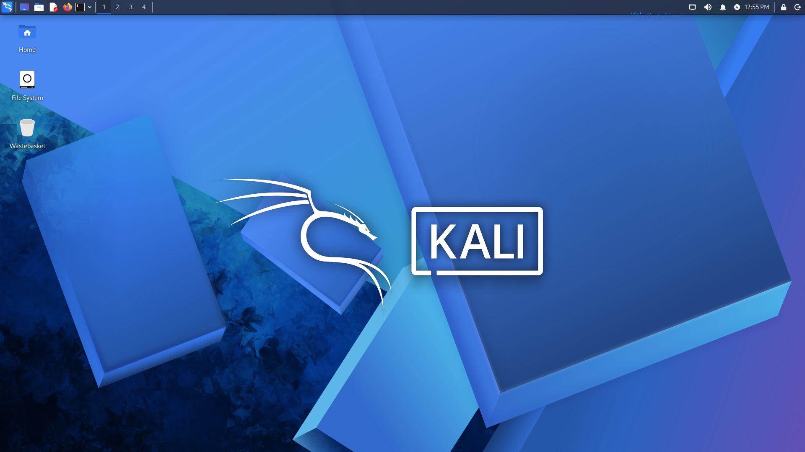
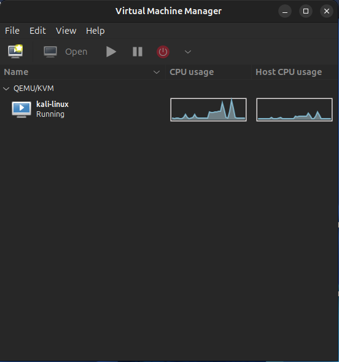

# Security Homelab

## Overview
This project documents the setup and configuration of a personal cybersecurity homelab built on Ubuntu using KVM/QEMU and Kali Linux.

The goal of this lab is to create a practical environment for learning virtualization, Linux system administration, and cybersecurity fundamentals in an isolated and controlled setup.

## Objectives
- Learn Linux-based virtualization with KVM/QEMU
- Build and manage virtual machines for security practice
- Troubleshoot common virtualization issues
- Document a reproducible homelab environment

## Environment
- **Host OS:** Ubuntu
- **Hypervisor:** KVM/QEMU
- **VM Manager:** virt-manager
- **Guest OS:** Kali Linux

## Key Features
- KVM/QEMU virtualization setup
- Kali Linux virtual machine deployment
- Guest agent integration
- Display and input optimization
- Troubleshooting documentation

## Screenshots

### Kali Linux Running

### Virtual Machine in virt-manager

## Documentation

- [Setup Process](docs/setup-process.md)
- [Troubleshooting](docs/troubleshooting.md)

## What I Learned

- How to install and configure KVM/QEMU on Linux
- Managing virtual machines with virt-manager
- Troubleshooting ISO detection issues
- Fixing display and input problems in virtual environments
- Understanding guest integration tools

## Future Improvements
- Add more vulnerable machines to the lab
- Automate setup with scripts
- Expand into networking and security testing scenarios
