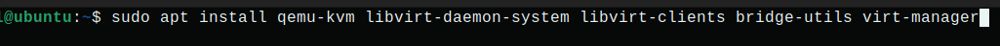
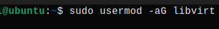
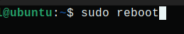
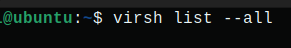
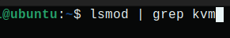
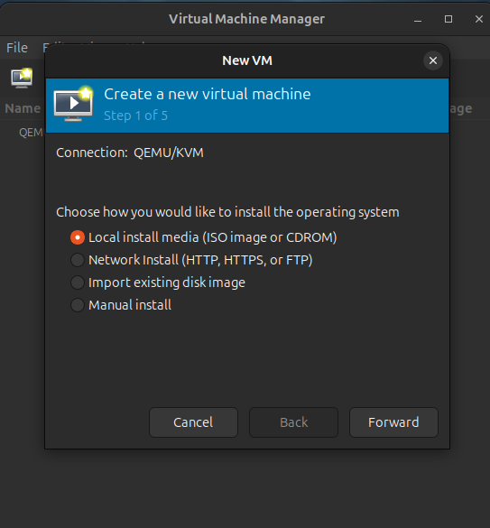
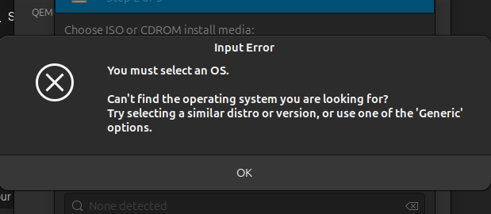
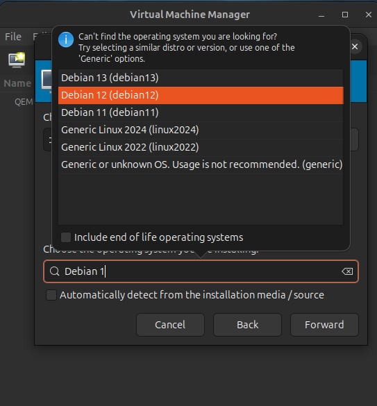
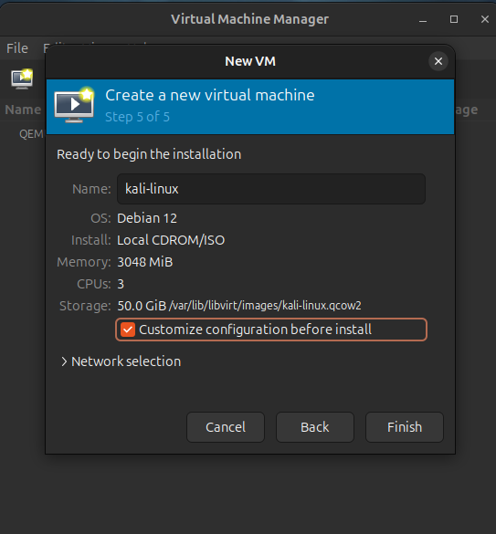
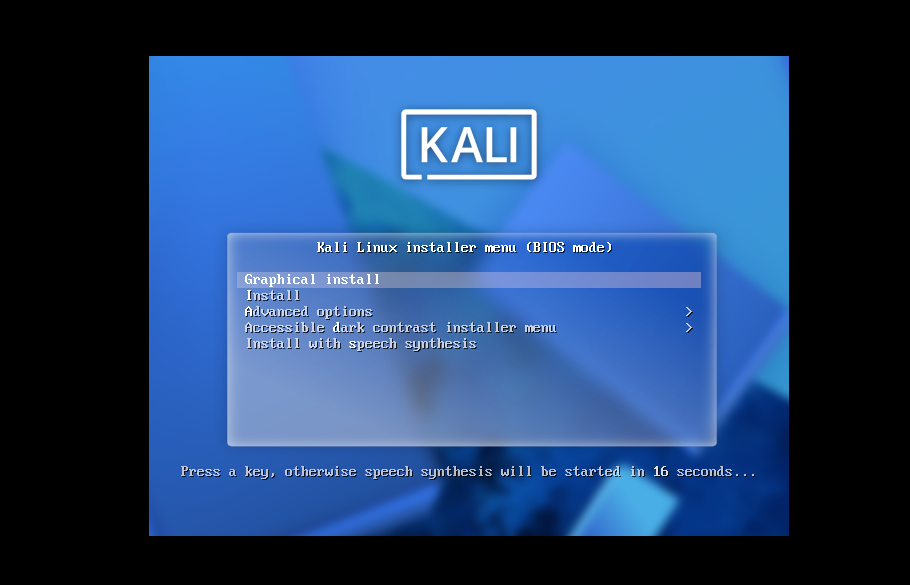

# Setup Process

## Installing KVM and Virtualization Tools

The first step in building the homelab was installing the required KVM/QEMU and virtualization management packages on the Ubuntu host system.



## Adding User to libvirt Group

To allow the current user to manage virtual machines without requiring root privileges, the user was added to the `libvirt` group using the following command:

```bash
sudo usermod -aG libvirt $USER
```

After this change, a system reboot is required for the new group permissions to take effect.



## Rebooting the Host System

After modifying group membership, the host system was rebooted to apply the changes.



## Verifying KVM Installation

The virtualization stack was verified by checking libvirt functionality and loaded KVM kernel modules.





## Creating the Virtual Machine

The virtual machine was created using virt-manager by selecting the option to create a new VM.



## ISO Detection Issue

During the setup process, virt-manager failed to automatically detect the Kali Linux ISO.



## Manual OS Selection

To resolve this issue, automatic OS detection was disabled and Debian 12 was selected manually, since Kali is Debian-based.



## Customizing VM Configuration

Before starting the installation, the option to customize the virtual machine configuration was enabled.

This allows adjusting hardware settings such as RAM, CPU, and storage before booting the installer.



## Kali Linux Installation

The installation was performed using the graphical installer provided by Kali Linux.


